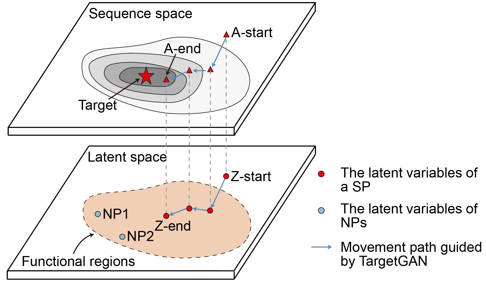

# TargetGAN

[](https://docs.python.org/3.8/library/index.html)
[](https://www.tensorflow.org/install/gpu)

<p align="center">
  
</p>

## Data Download 💾

Datasets, model weights, and logs required to reproduce the paper's results are hosted on Figshare:
[](https://doi.org/10.6084/m9.figshare.31482604)

Please download the ZIP files (`wgan-gp.zip`, `targetgan-logs.zip`, `data_for_plot.zip`) from our Figshare repository and extract them into their respective directories in this project.

## 1. Install 🚀

```bash
git clone https://github.com/xlxianglei/TargetGAN.git
cd TargetGAN
conda env create -f targetgan.yml
conda activate targetgan
```

## 2. Training WGAN-GP ✒️

Train the WGAN-GP model to learn the distribution of natural promoter sequences. This is the foundational generative model.

```bash
python main.py --work wgan-gp \
    --wgan_gp_log_dir ./wgan-gp-test \
    --data_loc "./data/Natural_promoters.xlsx" \
    --device "0,1"
```

**Key Arguments:**
* `--work wgan-gp`: Mode for training WGAN-GP.
* `--wgan_gp_log_dir`: Directory to save logs, checkpoints, and samples.
* `--data_loc`: Path to the dataset (e.g., './data/Natural promoters.xlsx').
* `--device`: GPU device IDs to use (e.g., "0" or "0,1").
* `--batch_size`: Batch size for training (default: 128).
* `--train_iters`: Number of training iterations (default: 100000).

**Performance Reference:**
* **Hardware**: 2x NVIDIA GeForce RTX 3090
* **Training Time**: Approximately 11 hours for 100000 iterations

## 3. Generate Promoters with WGAN-GP ✏️

Use the trained WGAN-GP generator to produce new synthetic promoter sequences without specific optimization targets.

```bash
python main.py --work generate \
    --generator "./data/generator.h5" \
    --generated_seqs_save_path "./samples/" \
    --generate_num_seqs 5000
```

**Key Arguments:**
* `--work generate`: Mode for generating sequences.
* `--generator`: Path to the trained generator `.h5` file (e.g., `.../generator.h5`).
* `--generated_seqs_save_path`: Directory to save the generated sequences.
* `--generate_num_seqs`: Number of sequences to generate (default: 76851).
* `--generate_batch_size`: Batch size for generation (default: 10).

## 4. TargetGAN Optimization (Targeted Generation) ⚡

Optimize the latent vectors to generate promoters with specific activity levels (e.g., maximum activity, minimum activity, or a specific value). This step uses the trained Generator and a Predictor model.

```bash
python main.py --work targetgan \
    --target max \
    --targetgan_log_dir ./targetgan-logs \
    --device "0"
```

**Key Arguments:**
* `--work targetgan`: Mode for running TargetGAN optimization.
* `--target`: Optimization objective. Options:
    * `max`: Maximize activity.
    * `min`: Minimize activity.
    * `float value`: Target a specific activity score (e.g., `2.0`).
* `--predictor`: Path to the pre-trained predictor model (default: `./data/predictor.h5`).
* `--generator`: Path to the WGAN-GP generator to use as the base.
* `--targetgan_log_dir`: Directory to save optimization logs and result sequences.
* `--step_size`: Learning rate for optimization (default: 1e-2).
* `--iterations`: Number of optimization steps (default: 10000).

---

## 5. Reproducibility & Analysis 📊

We provide comprehensive Jupyter Notebooks containing the code for all data processing, statistical analysis, and figure generation presented in the paper. These resources allow researchers to reproduce our results and gain deeper insights into the methodology.

You can find them in the [`notebooks`](./notebooks) directory:

| Notebook | Description |
| :--- | :--- |
| [Paper_Figure2_WGAN_GP.ipynb](./notebooks/Paper_Figure2_WGAN_GP.ipynb) | Analysis and plotting for WGAN-GP performance (Figure 2). |
| [Paper_Figure3_TargetGAN.ipynb](./notebooks/Paper_Figure3_TargetGAN.ipynb) | Results and visualizations for TargetGAN optimization (Figure 3). |
| [Paper_Figure4_STARR_seq_LUC.ipynb](./notebooks/Paper_Figure4_STARR_seq_LUC.ipynb) | Processing and analysis of STARR-seq and Luciferase data (Figure 4). |
| [Paper_Figure5_motif_analysis.ipynb](./notebooks/Paper_Figure5_motif_analysis.ipynb) | Exploration and visualization of motif enrichment (Figure 5). |
| [Paper_Figure6_LR.ipynb](./notebooks/Paper_Figure6_LR.ipynb) | Logistic Regression analysis and related plots (Figure 6). |

To run these notebooks, ensure you have the required dependencies installed as per the [Installation](#1-install-) section.

---

## 6. Motif Analysis with TF-MoDISco 🧬

To interpret the learned features of our model and discover enriched motifs in the generated sequences, we provide a complete workflow using **DeepLIFT** and **TF-MoDISco**.

### 6.1 Setup Environment

Since DeepLIFT and TF-MoDISco have specific dependency requirements (TensorFlow 1.x), please create a separate conda environment:

```bash
cd modisco
conda env create -f deeplift_environment.yml
conda activate deeplift
```

### 6.2 Run Analysis

The entire analysis pipeline is encapsulated in the Jupyter Notebook:
[`modisco/combined_workflow.ipynb`](modisco/combined_workflow.ipynb)

This notebook covers:
1.  **DeepLIFT**: Calculating contribution scores for nucleotides in your sequences.
2.  **TF-MoDISco**: Clustering these scores to discover consolidated motifs.
3.  **Visualization**: Plotting the discovered motifs and analyzing their biological significance.

**Input Data:**
-   Ensure your model (`predictor.h5`) and data (`targetgan.xlsx` or similar) are placed in the `data/` directory as expected by the notebook.

**Output:**
-   The notebook generates visualization figures and saves the discovered motifs in MEME format (`.meme`) for standard motif analysis tools.

---

## 7. Provided Resources 📂

If you wish to use our synthetic promoters in your research, we provide here 20,480 synthetic promoters targeting max, as well as 10,240 synthetic promoters for each of the remaining eight targets. Their paths are located under `target_promoters`.

## Contact 📧

Feel free to contact us if you have any questions or suggestions regarding the code and models.